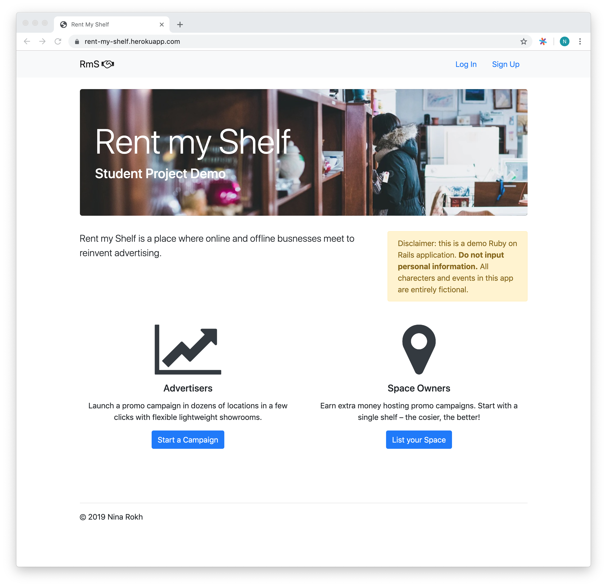
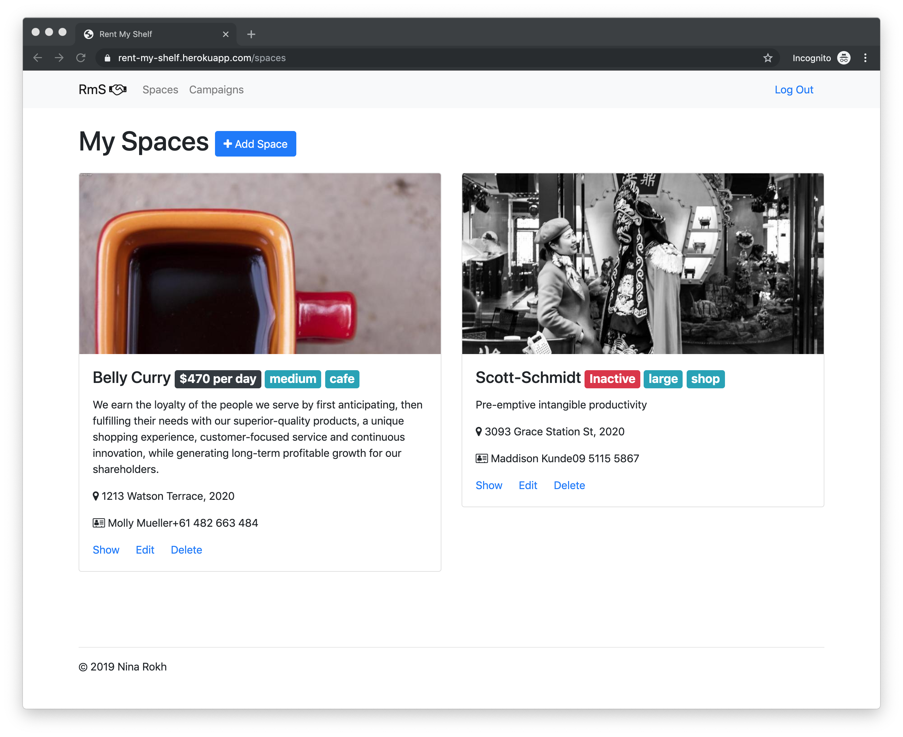
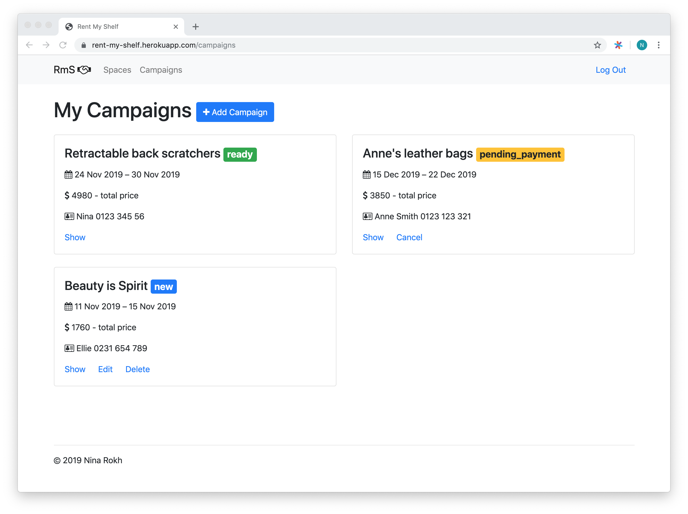
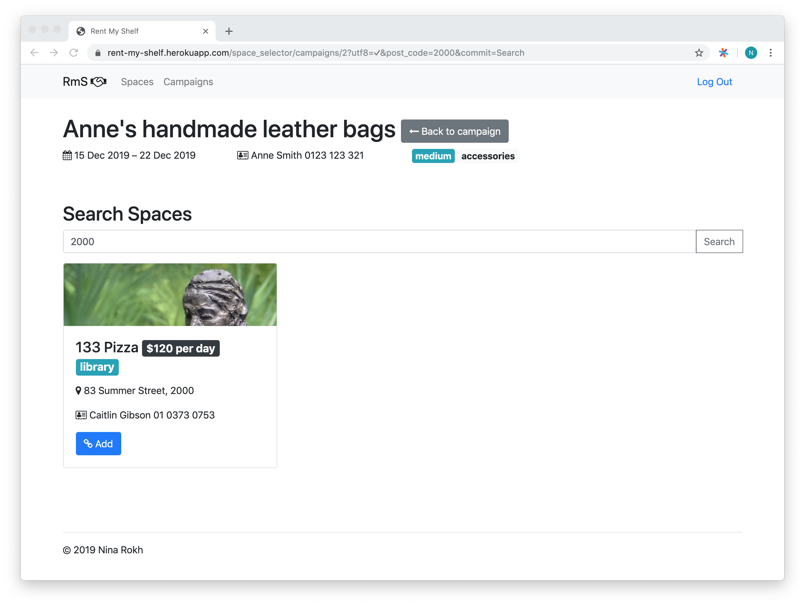
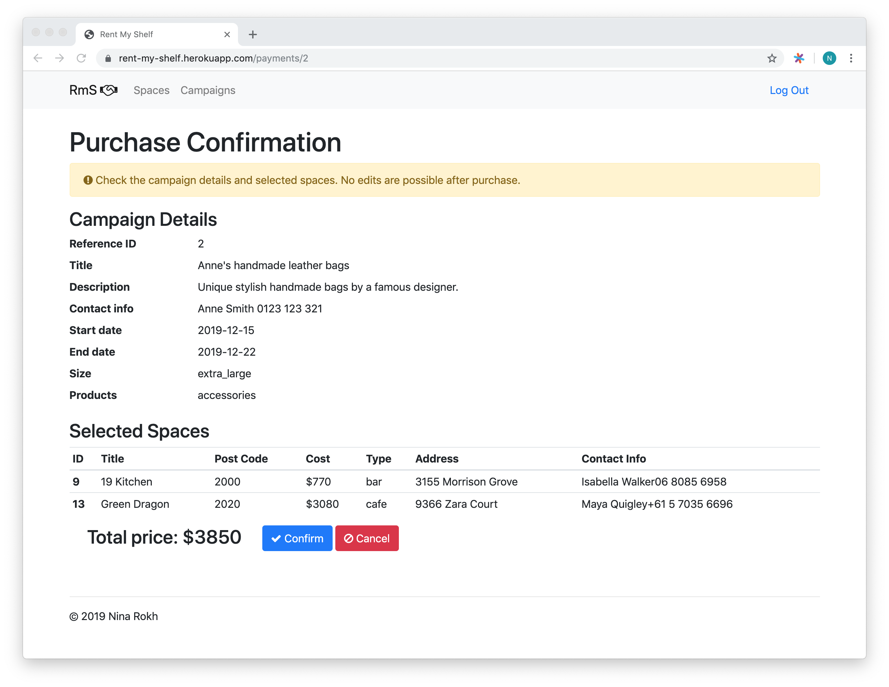
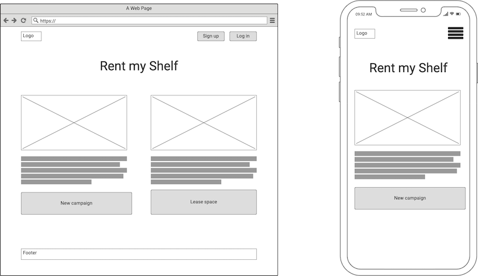
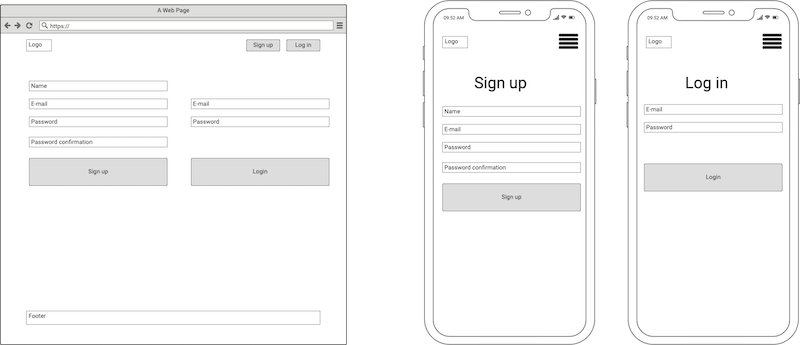
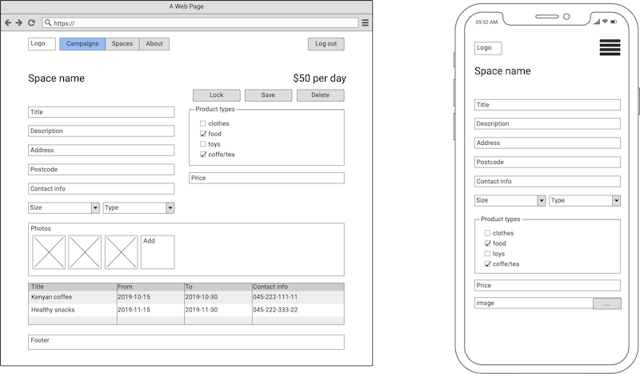
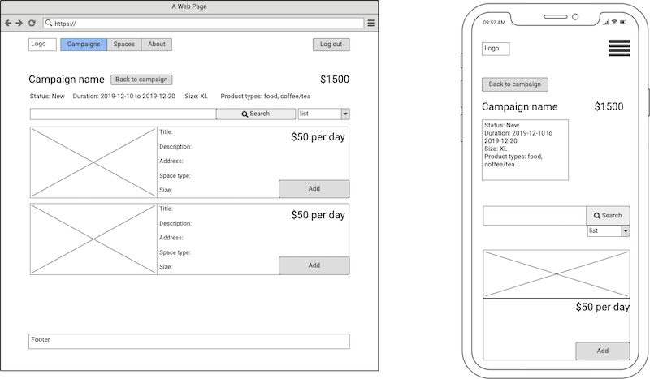
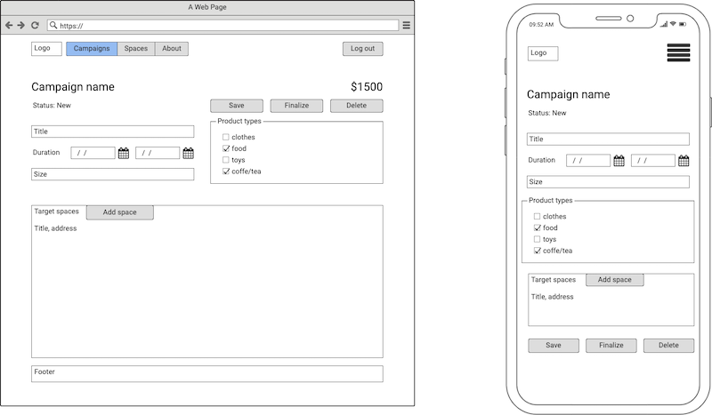

# Rent my shelf

[Demo (do not input sensitive data)](https://rent-my-shelf.herokuapp.com)

[Code](https://github.com/INRokh/rent-my-shelf)

[Trello](https://trello.com/b/CQRK1IMa/rentmyshelf)

## Goal

The service that allows to run promotion campaigns in lightweight showrooms offered by space owners.

## Problem definition and solution

Many businesses such as shops and cafes require physical space. However, they rarely use space completely. Other businesses may be done online and don’t require physical space per say, but can benefit from offline presence. For example, an online store may use local coffee shops to display their goods. Designers may promote their new collection in clothing shops.

The service allows online businesses to extend they promotion channels with clusters of lightweight offline showrooms. A promotion campaign may include dozens of such spaces covering target location and types of hosts. The key advantage is that starting a campaign is very easy and thus inexpensive.

Space owners, on the other hand, can get extra money without any effect on their core business.

## Major user scenarios 

The main user of the system is the party that wants to rent a space (shelf) for promotion referred as advertiser. The spaces are provided by another party referred as space owners or hosts. The main entity is a campaign. Advertisers run and pay for campaigns. Space owners host the camapigns and receive payments.

### Starting a promotion campaign

Advertiser starts a promo campaign:

1. User creates a promotion campaign specifying campaign timeframe, categories of products, location, size.
1. The system suggests the spaces matching campaign parameters.
1. User chooses one or more spaces.
1. User reserve spaces for given timeframe.
1. User pays for the campaign.
1. User gets space specific instructions (not implemented).
1. User arranges promotion material shipping, assembly and collection (offline).

### Adding a new space

Host lists a their space.

1. Space owner creates a new space specifying availability date, type of space, address, contact info, price, size, images and categories of products.

### Space campaigns

Host checks completed and upcoming campaigns in their space.

1. Space owner opens a space and sees a calendar with all campaigns in that space.
1. The space owner is also notified by email a few days before each new campaign (not implemented).

## Application description.

### Purpose ###

Rent my Shelf allows users to run or host advertising campaigns.

### Target Audience ###

Business owners looking for either advertise their businesses or to host such advertisements.

### Features ###

#### Core ####

1. User management - ability to sign up, log in and reset password.
1. Space management - CRUD with the ability to add a picture to the space.
1. Campaign management - CRUD restriced to campaign status. 
1. Campaign and Space linkage - ability to search and link spaces to campaigns.
1. Campaign check out - ability to reserve spaces and to pay for campaign.
1. Order logging - ability to log transactions.

#### Aux (not implemented) ####

1. About page with user-friendly documentation.
1. Order view - ability to examine orders.
1. Map view for space search.
1. Pagination for spaces and campaigns.
1. E-mail notifications for campaign status changes.
1. E-mail notifications for upcoming campaigns to space owner.
1. Analytics for ongoing campaigns.
1. Archiver Job for archiving past campaigns.
1. Multiple images per campaign.
1. Full support of S3 integration: direct upload, background resizing.

### Sitemap ###

```
- root
    - home
    - user management
        - login
        - sign up
    - spaces
        - space view
        - space edit
    - campaigns
        - campaign view
        - campaign edit
        - space selection
        - payment
```

### Screenshots ###











### Tech stack ###

1. Font Awesome
1. Bootstrap
1. Stripe (payments)
1. Ruby on Rails
1. PostgreSQL
1. AWS S3
1. Heroku

## User stories

1. Host creates a new account.
1. Host lists their spaces.
1. Host edits space parameters.
1. Host deletes a space that doesn't have any campaigns.
1. Host marks a space as inactive to hide the space from listing.
1. Advertiser creates a new account.
1. Advertiser lists their campaigns.
1. Advertiser edits campaign parameters befor adding any spaces.
1. Advertiser deletes a campaign that is not paid.
1. Advertiser adds or removes spaces to a campaign.
1. Advertiser checks out campaign being provided with total cost.
1. Advertiser decides to cancel purchase.
1. Advertiser pays for campaign.
1. Advertiser uses post code search when selecting spaces.
1. Host starts a promo campaign acting as an advertiser.
1. Advertiser lists their spaces acting as a host.

## Wireframes ##

Wireframes include not implemented elements.











## ERD 


## High level design

The application serves the traffic using PostgreSQL as a DB and AWS S3 as a storage for media objects (images). The data is defined by four models: user, space, campaign and order. User model is used by Devise to implement authentication and user management. Space model is used with space controller and corresponding views. Same for Campaign model. There is another controller that links spaces and campaigns called Space Selector. And, finally, Payments controller that interacts with Stripe payments service and logs orders to the Order model.

## Third party services ##

- Stripe to perform payments
- AWS S3 to store data
- Font Awesome to load icons
- Heroku to host the app

## Data model

__Campaign__ represent promotion campaign defined by the start date and duration. The campaign includes one or more spaces. Products promoted by this campaign will be displayed in these spaces. Campaign maintains basics per space stats. Campagnie can be in one of these statuses:

1. New - campaing is being created.
1. Pending Payment - campaign is finalized and needs to be paid.
1. Processing Payment - payment has been made but hasn't been confirmed.
1. Ready - payment is confirmed.
1. Finished - time of the campaign is passed and campaign is old.

Campaign belongs to a user.

Campaign is related to many spaces.

Campaign is related to an order when it is paid.

__Space(shelf)__ represent a physical space where products can be displayed. The space accommodates campaigns. Space can accommodate only one campaign at a time. Space includes detailed information and photos. Space can be active and visible in searches or inactive.

Space belongs to a user.

Space is related to many non-overlapping campaigns.

Space is related to many orders.

__User__ combines both space owners and users looking for spaces. In other words, a user of the system can own spaces and use other spaces for product promotion.

User owns spaces and campaigns.
 
__Campaign product category__ represent different types of products, for example clothes, food, accessories etc. Product types are used for matching spaces and campaigns.

Space is considered suitable for a campaign if it supports all product types requested by a campaign.

__Space category__ defines a type of the space, for example shop, cafe, bars etc.

__Order__ logs payment info (no credit card info is logged). This can be used for future reference.

## Project Management ##

Tasks are split into small user stories that can be completed in a few hours. If a task appears to be
bigger, it is split and re-prioritized. There are four boards:

1. Features - big features that need triage
2. ToDo - small user stories ready for implementation
3. Doing and Done - user stories being implemented and completed.