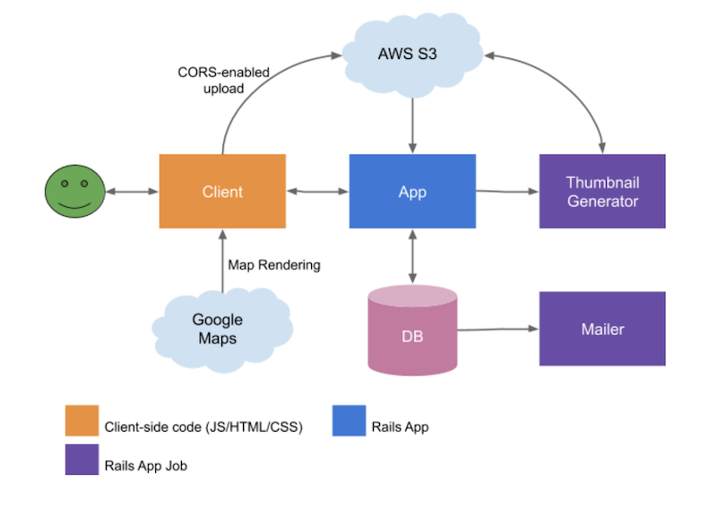

# Rent my shelf

## Goal

The service that allows space owners to lease shelves to small businesses.

## Problem definition and solution

Many businesses such as shops and cafes require physical space. However, they rarely use space completely. Other businesses may be done online and don’t require physical space per say, but can benefit from physical presence. For example, an online store may use local coffee shops to display their goods. Or designers may promote their new collection in clothing shops.

The main users of the system are the online businesses that would like to extend they promotion channels with clusters of lightweight offline showrooms. A promotion campaign may include dozens of such spaces covering target location and types of hosts. The key advantage is that starting a campaign is very easy and thus inexpensive. 

## Major user scenarios 

The main user of the system is the party that wants to rent a space (shelf) for promotion. The spaces are provided by another party referred as space owners or hosts.

### Starting a promotion campaign

1. User creates a promotion campaign specifying campaign timeframe, categories of products, location, size.
1. The system suggests the spaces matching campaign parameters.
1. User chooses one or more spaces.
1. User reserve spaces for given timeframe.
1. User has a few days for inspection of the spaces. 
1. User pays for the campaign.
1. User gets space specific instructions.
1. User arranges promotion material shipping, assembly and collection.

### Monitoring the campaign progress

1. User opens ongoing campaign. 
1. User can see foot traffic per space and per campaign.
1. Each space may use different promo codes that can be used to track performance.
1. Another option is to place QR codes under each item allowing customers to go straight to the item page in the online shop. The number of hits is also shown if available.

### Adding a new space

1. Space owner creates a new space specifying availability date, type of space, address, contact info, price, size, images and categories of products.
1. Setup integration with the foot traffic counter.

### Space campaigns

1. Space owner opens a space and sees a calendar with all campaigns in that space.
1. he space owner is also notified by email a few days before each new campaign.

## High level design

High level design covers basic features of the service. The application serves the traffic using PostgreSQL as a DB and AWS S3 as a storage for media objects (images). Mailer job sends periodic notifications about campaigns. Thumbnail Generator job performs media processing. The client code uses Google Maps to render the map with space locations.

## Data model

Campaign represent promotion campaign defined by the start date and duration. The campaign includes one or more spaces. Products promoted by this campaign will be displayed in these spaces. Campaign maintains basics per space stats. Campagnie can be in one of these states: 
* New
* In progress
* Finished

__Space(shelf)__ represent a physical space where products can be displayed. The space accommodates campaigns. Space can accommodate only one campaign at a time. Space includes detailed information and photos. 

__User__ combines both space owners and users looking for spaces. In other words a user of the system can own spaces and use other spaces for product promotion.  
 
__Campaign product category__ represent different types of products, for example clothes, food, accessories etc. Product types are used for matching spaces and campaigns. 

__Space category__ defines a type of the space, for example shops, cafes, bars etc.    

## ERD 

## UI mockups

